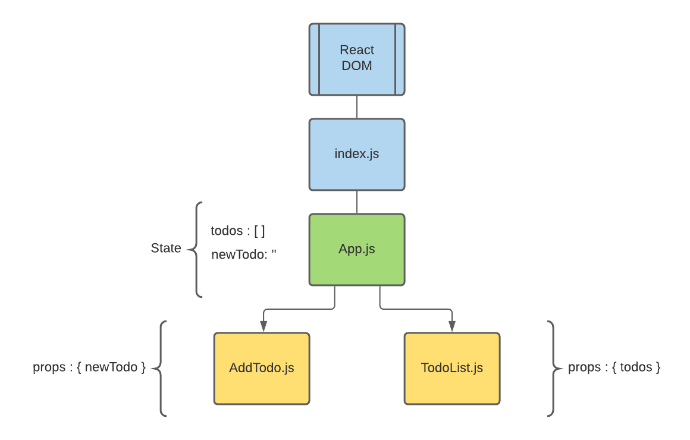
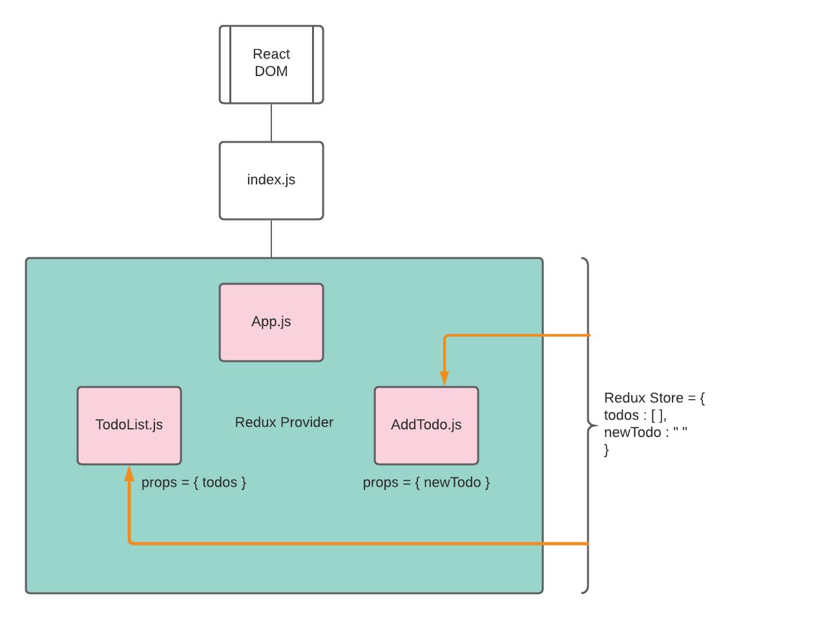

# Introduction To React and Redux

## Objectives

- Setup Redux with a react app
- Start initial set up for Redux Todo List

## Getting Started

- Fork and Clone
- `npm install`

## React and State Management

React by default comes with it's own way to handle `state`. We've seen `class` based components with `this.state` and we've seen `functional` components with `useState`.

Typical state management follows the top down pattern, where our state is unidirectional in a downward direction. This is referred to as passing props.

Here's an example of React's out of the box data flow:



**State must be passed in a downward manner as props to other components.**

What if I told you there was an easier way?

Enter Redux!

## Redux

What is `Redux`?

> Redux itself is a standalone library that can be used with any UI layer or framework, including React, Angular, Vue, Ember, and vanilla JS. Although Redux and React are commonly used together, they are independent of each other.

For React integration we'll be using one of Redux's binding libraries specifically made for react called `React Redux`.

### React Redux

Although you don't always need Redux for every application you build, it's important to understand why you would use `React Redux`.

From the `Redux Docs`:

> ## It is the Official Redux UI Bindings for React
>
> While Redux can be used with any UI layer, it was originally designed and intended for use with React. There are UI binding layers for many other frameworks, but React Redux is maintained directly by the Redux team.
>
> As the offical Redux binding for React, React Redux is kept up-to-date with any API changes from either library, to ensure that your React components behave as expected. Its intended usage adopts the design principles of React - writing declarative components.

> ## It Encourages Good React Architecture
>
> React components are a lot like functions. While it's possible to write all your code in a single function, it's usually better to split that logic into smaller functions that each handle a specific task, making them easier to understand.
>
> Similarly, while you can write large React components that handle many different tasks, it's usually better to split up components based on responsibilities. In particular, it is common to have "container" components that are responsible for collecting and managing some kind of data, and "presentational" components that simply display UI based on whatever data they've received as props.
>
> The React Redux connect function generates "container" wrapper components that handle the process of interacting with the store for you. That way, your own components can focus on other tasks, whether it be collecting other data, or just displaying a piece of the UI. In addition, connect abstracts away the question of which store is being used, making your own components more reusable.
>
> As a general architectural principle, we want to keep our own components "unaware" of Redux. They should simply receive data and functions as props, just like any other React component. This ultimately makes it easier to test and reuse your own components.
>
> It Implements Performance Optimizations For You#
> React is generally fast, but by default any updates to a component will cause React to re-render all of the components inside that part of the component tree. This does require work, and if the data for a given component hasn't changed, then re-rendering is likely some wasted effort because the requested UI output would be the same.
>
> If performance is a concern, the best way to improve performance is to skip unnecessary re-renders, so that components only re-render when their data has actually changed. React Redux implements many performance optimizations internally, so that your own component only re-renders when it actually needs to.
>
> In addition, by connecting multiple components in your React component tree, you can ensure that each connected component only extracts the specific pieces of data from the store state that are needed by that component. This means that your own component will need to re-render less often, because most of the time those specific pieces of data haven't changed.

> ## Community Support
>
> As the official binding library for React and Redux, React Redux has a large community of users. This makes it easier to ask for help, learn about best practices, use libraries that build on top of React Redux, and reuse your knowledge across different applications.

## Redux Flow and Setup

Let's start by installing the [Redux devtools](https://chrome.google.com/webstore/detail/redux-devtools/lmhkpmbekcpmknklioeibfkpmmfibljd)

This tool will allow us to monitor state and any changes in our apps.

### Flow

Because `Redux` operates using a single `Store` to handle our state, it makes deciding which components should store state a lot easier to decide on. Essentially, none of our components store state, `Redux` handles it all for us and allows us to accept that information as `props`.

Here's an example:



Redux is built on the concept of `Reducers`, `Actions` and `Types`.

- Reducers are we can break up our state into little modules.
- Actions are things that we perform to update the state.
- Types are a definition of the actions we are performing.

We'll put some of this into practice in just a bit.

### Setup

A react app has been provided for you.

If you haven't installed your dependencies yet, do so now by running `npm install`.

In order to use `Redux` with our react app we'll need to install a couple of new dependencies called `react-redux` and `redux`.

Run `npm install react-redux redux`

Once your install has finished let's create a new folder called `store`.
This folder is going to hold our `Actions`, `Types` and `Reducers`.

Start by creating an `index.js` file in the `store` folder.

Once you've created the `index.js` file, open it in your code editor.

Let's add the following:

```js
import { createStore } from 'redux'

const store = createStore()

export default store
```

Now head over to the react app `index.js` where we call `ReactDom.render()`. We need to connect our new Redux store to our react app make your `index.js` look like the following.

```js
import React from 'react'
import ReactDOM from 'react-dom'
import './styles/index.css'
import App from './App'
import { Provider } from 'react-redux'
import store from './store'

ReactDOM.render(
  <React.StrictMode>
    <Provider store={store}>
      <App />
    </Provider>
  </React.StrictMode>,
  document.getElementById('root')
)
```

Let's break this down:

- We import the `Provider` component from `react-redux`, this component accepts a `store` prop that is our `store` we created in the previous step.
- We wrap our `App` component inside of the provider to give any component that lives within `App.js` access to our redux store.

## Exit Notes

We've successfully implemented a redux store with our react app. We'll be using this same repo for the next few lessons.

## Resources

[Redux Docs](https://react-redux.js.org/)

[Why Redux?](https://almerosteyn.com/2016/08/redux-explained-again)
